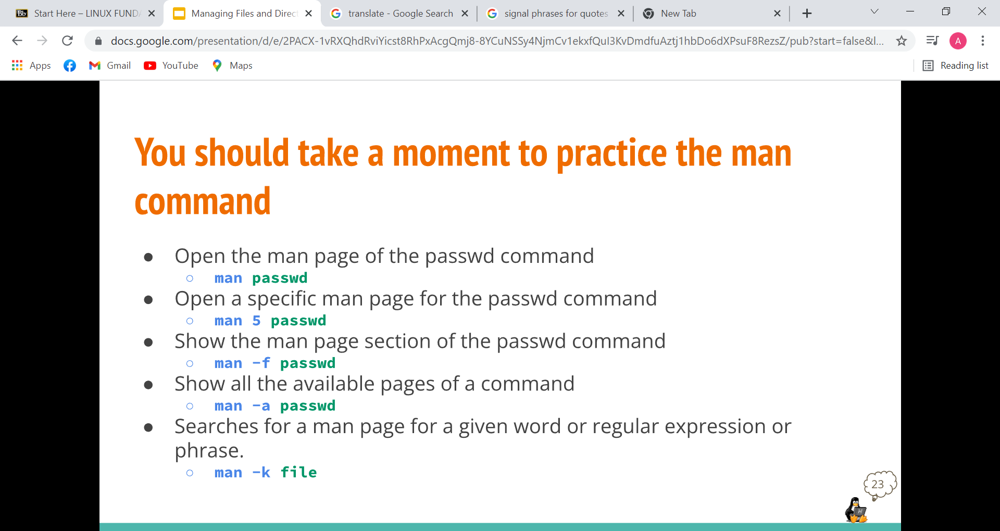
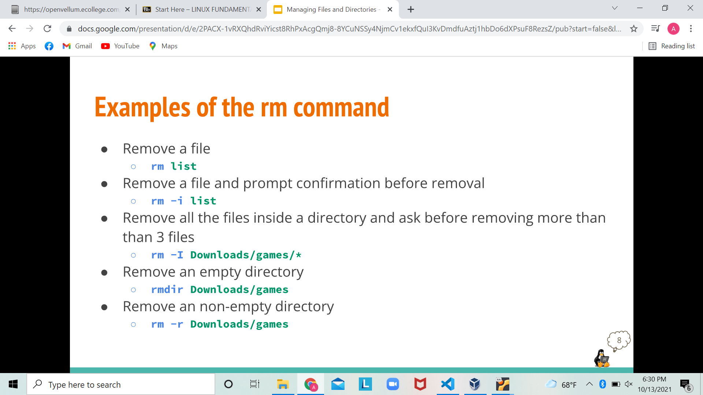

**Lab4 Notes**
-------------------
*Here is some Examples of the "mkdir" command.*
----------------------------------------------

*Here is how to move files and directories*
-------------------------------------------

*Here is how to practice on the man command*
--------------------------------------------

*Here is how to create files*
----------------------------

*Some examples of renaming files*
---------------------------------

*Some examples of rm command*
-----------------------------

*The Wildcard*
--------------

*What is the Wildcards/File*
---------------------------
